# Online Book Store
## The online bookstore application is built using the Spring Boot framework with Spring Data, Spring Security, Postgres Database.
## Link to website: 

## Home page
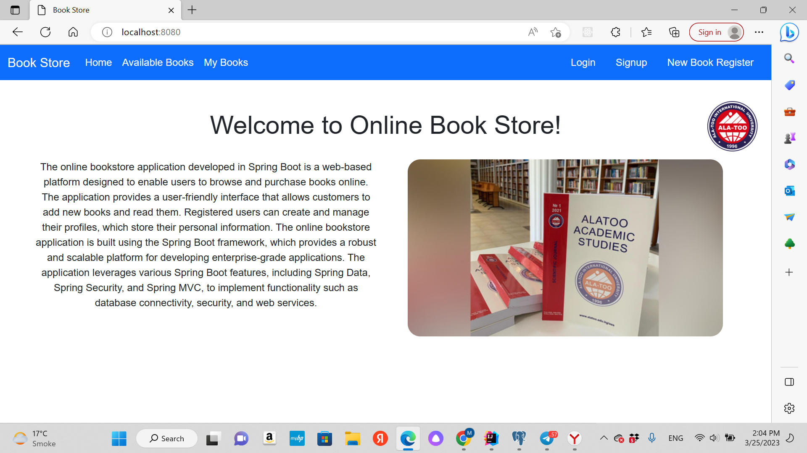
## Signup page
## You can sign up on this page by entering your login, email and password:
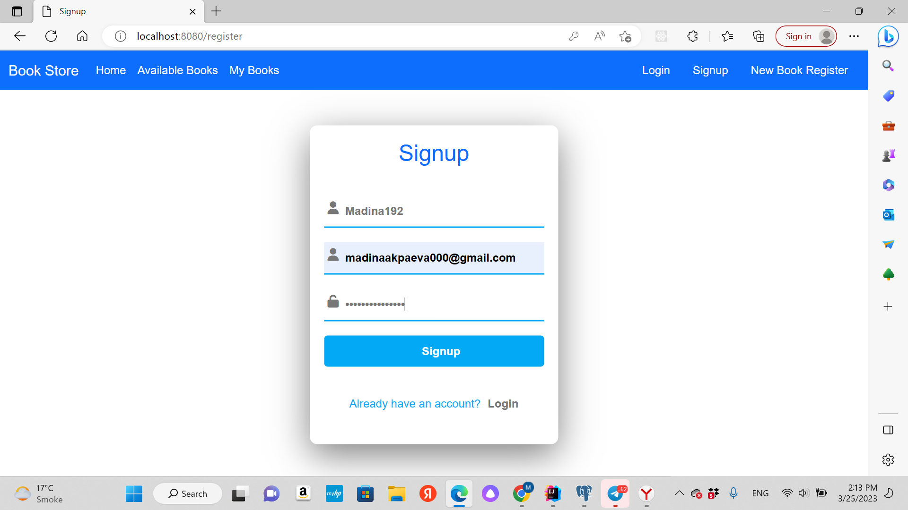
## Login page
## If you have signed up, you can sign in by entering login and password:
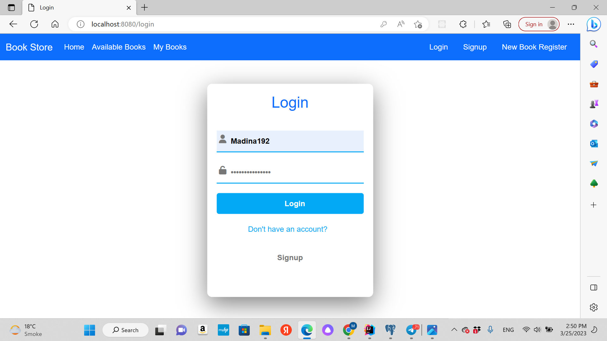
## If you entered incorrect data, you'll ger an error:
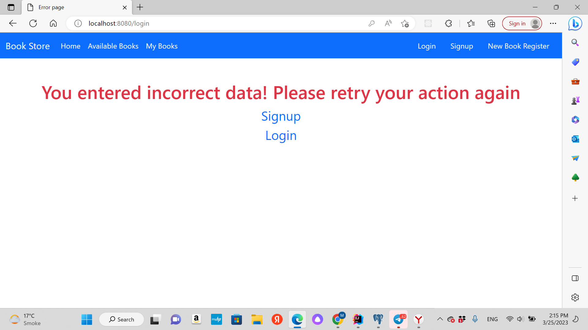
## When you signed in it redirects you to personal page:
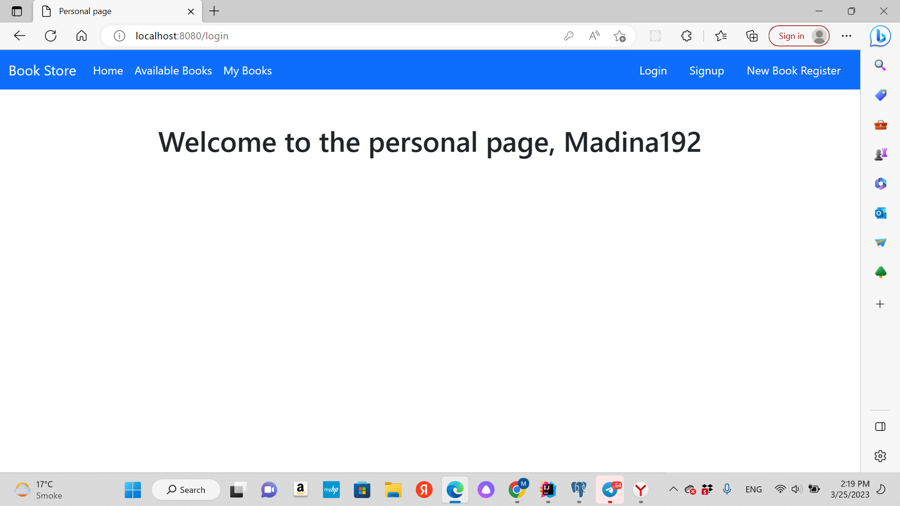
## Available Books Page
## You can see here all books you have added by admin and can add them to you books list:
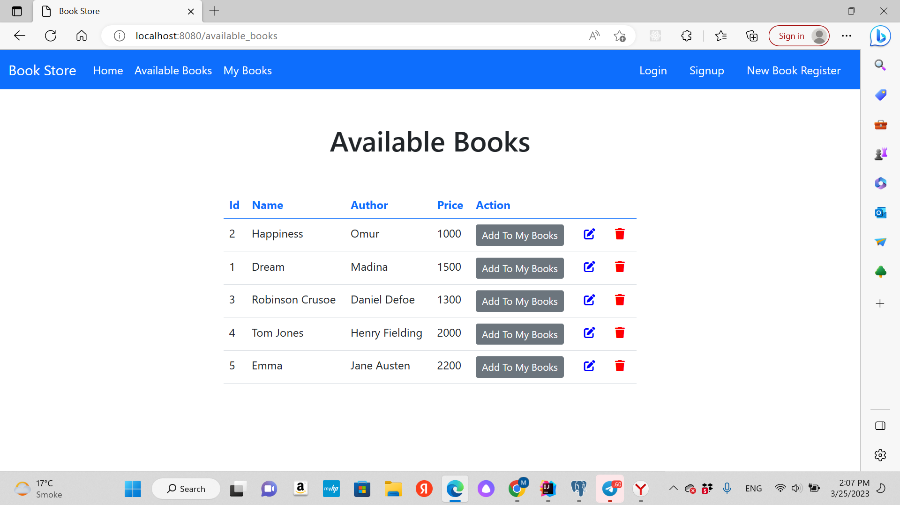
## My Books Page
## Here you can see your books list, you can delete them if you want:
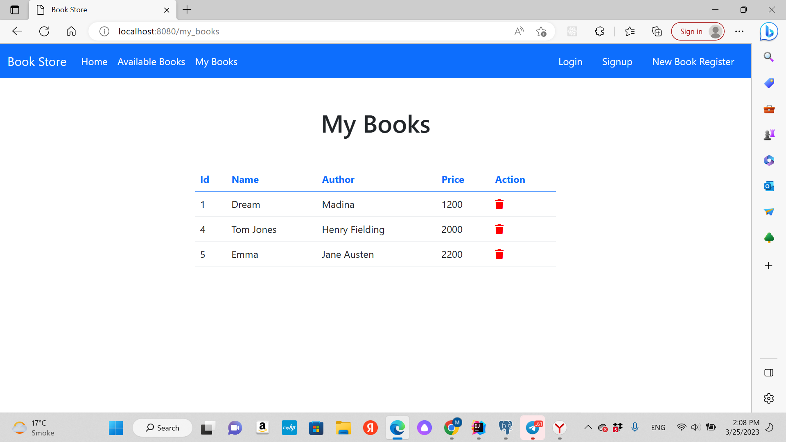
## Only admins can add new book:
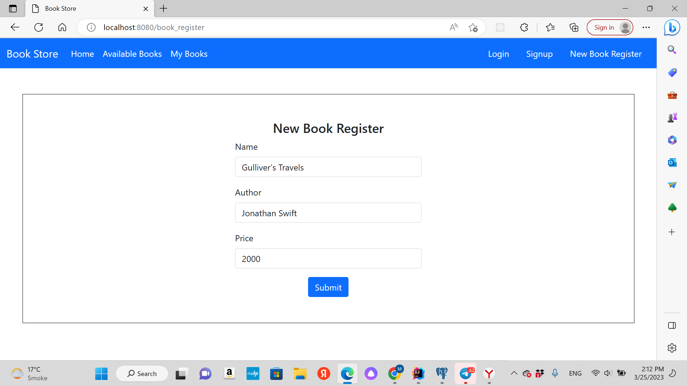
## Also they can edit the information about book:
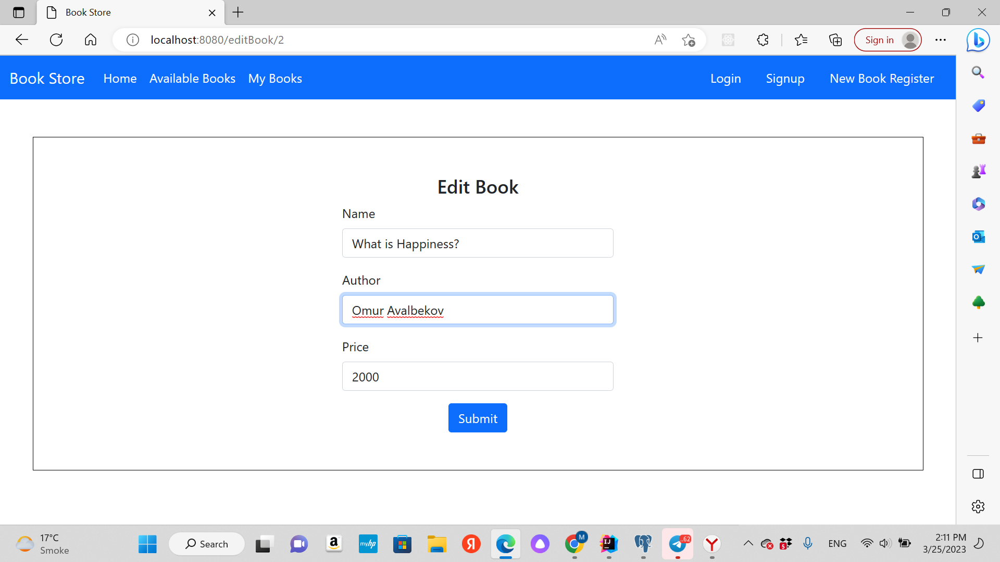
# Database schema:

## pgAdmin screenshots:
## Book list:
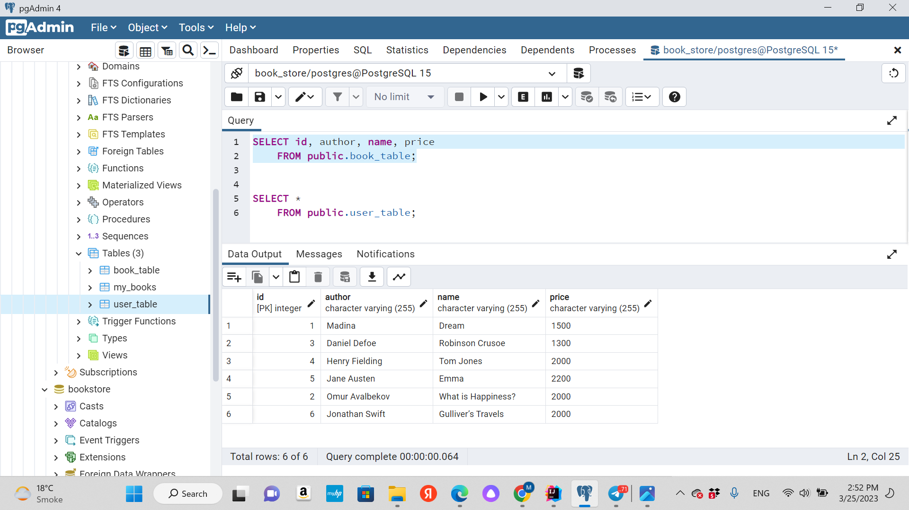
## Users list:
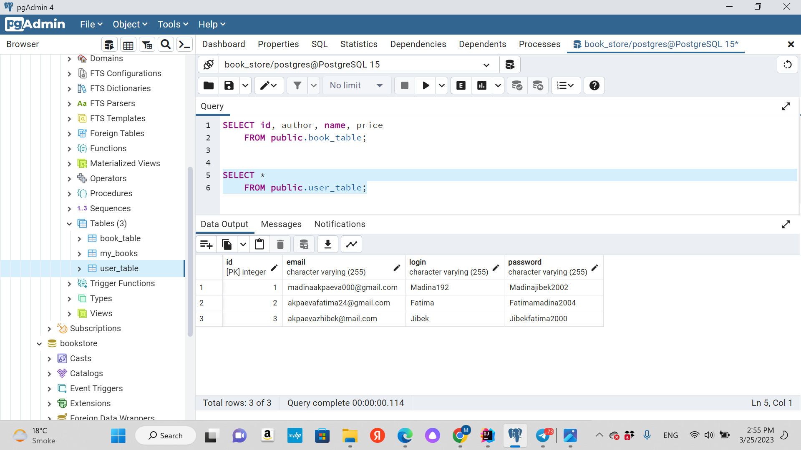

